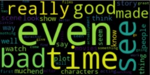
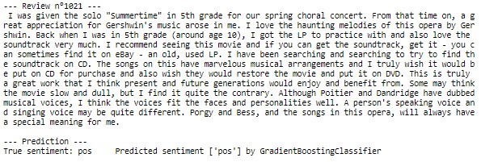
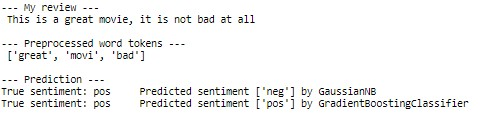
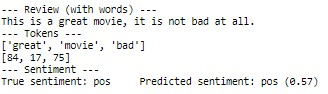

# Sentiment-Analysis-using-various-classifiers
Experiment sentiment analysis using regular classifiers and deep neural networks then compare performance.

# Description

The project builds an end-to-end sentiment classification system from scratch. It is part of Udacity [Natural Language Processing Nanodegree](https://www.udacity.com/course/natural-language-processing-nanodegree--nd892).
The objective is to train a model able to predict the sentiment of the movie review as either positive or negative.

 

# Dataset

The dataset used is very popular among researchers in Natural Language Processing, usually referred to as the [IMDb dataset](http://ai.stanford.edu/~amaas/data/sentiment/). It consists of movie reviews from the website imdb.com, each labeled as either 'positive', if the reviewer enjoyed the film, or 'negative' otherwise.
It is composed of 50,000 reviews, split equally between train and test sets. Proportions of positive and negative reviews are identical.

# Project structure
- Data exploration
- Preprocessing (cleaning and preparing the text as input to the model)
- Compute Bag Of Words features
- Train a model using Bag of Words features
    - Gaussian Naive Bayes model
    - Gradient Boosted Decision Tree
- Test these regular models
- Prepare input for Recurrent Neural Network (RNN)
- Train RNN model using LSTM cells
- Evaluate RNN model

# Models

The task of sentiment analysis can be solved via a traditional machine learning approach: BoW + a nonlinear classifier. We code each sentence into a one-hot vector made of 0 and 1 of size the total vocabulary of the dataset. Words that are present in the sentence are represented with a 1 (or the number of occurences in the sentence for BoW representation) and all others get 0. We end up with highly sparse and very long vectors, one for each sentence. 

The weakness of BOW is that it ignores the order in which the words appear. So for instance, if you have a positive word and a negation of that positive word, the BOW might not discover that it is in fact a negative sentiment. The order of the words is ignored. Here is an example where the order of the words is critical :
- This is a great movie, it is not bad at all
- This is a bad movie, it is not great at all

The first one is a positive sentiment, the second is negative. But notice that both sentences include the same words exactly but in different order. In a one-hot encoding, or in a bag of words model, their resulting feature vectors accross the vocabulary will be identical. So one would imagine that the output is very similar too.

One way to fix this is to consider the order of the words. This is where RNNs and LSTMs come to the rescue. With an RNN (LSTM) architecture, we'd be feeding the word one by one. At each point, the model takes as input, the previous output, joined with the new word, in order to produce an output. The final output is an encoding of the sentence. Therefore, with a RNN, the sequence of words is taken into account as the network gets the words one by one in the proper sequence and then will predict the sentiment. More precisely, each word gets fed to an embedding layer which will translate the word into an embedding vector of fixed length. This dense vector will be fed into the RNN and this will repeat throughout the sequence of words

Once we have the encoding of this sentence after the last cell of the RNN, we run that through one or more dense layers, which will then get trained to predict the sentiment of the review (typical architecture for a classifier section).

Note that the BoW weakness would be circumvented using a pretrained embedding layer to encode the full sentence into an embedding vector preserving its semantic representation. You can think of the embedding as a tool to compress any textual data into a vector of fixed size while preserving the meaning. Yet the objective of this project is to highlight the properties of recurrent networks.

# Results

The first two models use the BoW and do not consider the order of words. The last two are processing words one after the other and can therefore capture additional semantic content.

TEST ACCURACY (unseen reviews):

- 72.3% <== BoW GaussianNB Classifier
- 85.8% <== GradientBoostingDecisionTree
- 87.3% <== RNN (simple RNN with embedding 32, LSTM dim 100 and dense output layer - 213k param)
- 87.8% <== Bi-directional LSTM (embedding of 64, 2 x bi-LSTM dim 32 and dense output layer - 370k parameters )

 

Although rudimentary, the RNN outperforms both regular classifiers. It is well above Naive Bayes classifier, and a few pct points above Gradient Boosted Tree. As mentionned, these two regular classifiers use BoW vectors not taking into account the sequence of the words.

The Bi-directional LSTM shows the highest accuracy after 2 epochs only. Like the simple RNN, it takes as input the sequence of words, allowing to capture more of the context vs regular classifiers. In addition, it is able to get information from past (backwards) and future (forward) states simultaneously (unlike a simple unidirectional LSTM which only leverages information of the past because the only inputs it has seen so far are from the past). The Bi-directional LSTM can see the past and future context of the word (influence of neighboring words go both ways) and is much better suited to capture more complex contextual information.

 

ADDITION:
- added sentiment analysis on amazon product reviews (naive bayes, logistic regression models)
